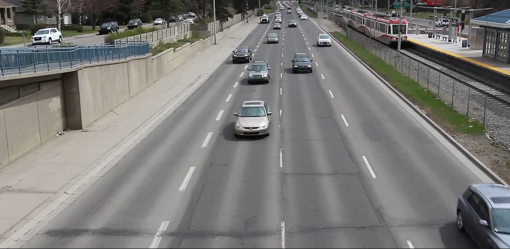
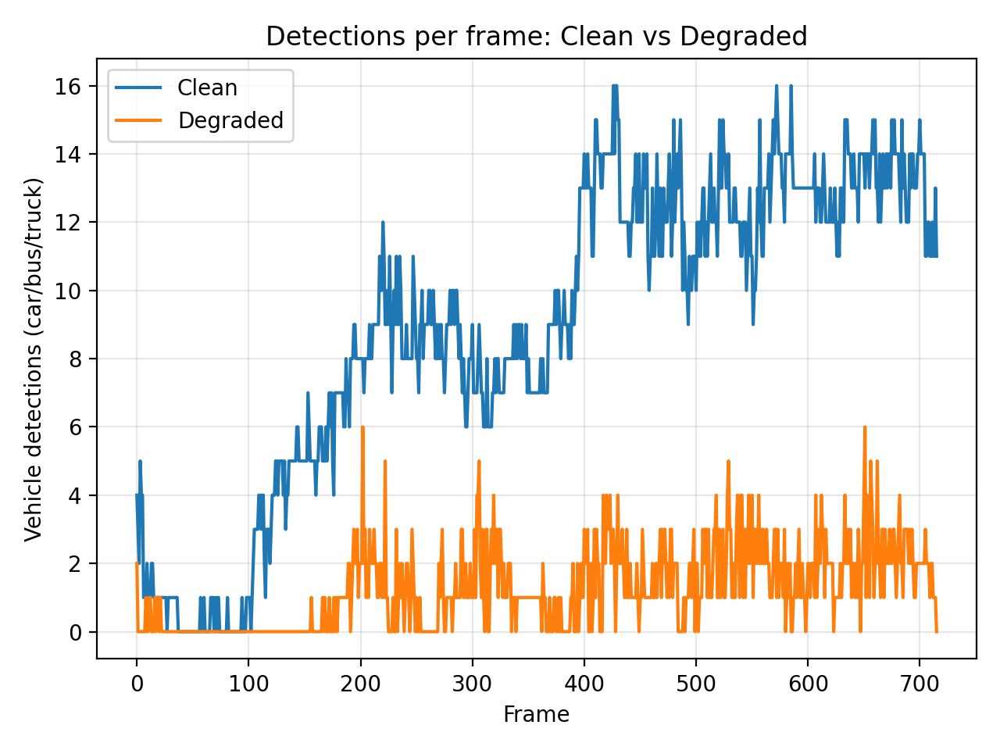
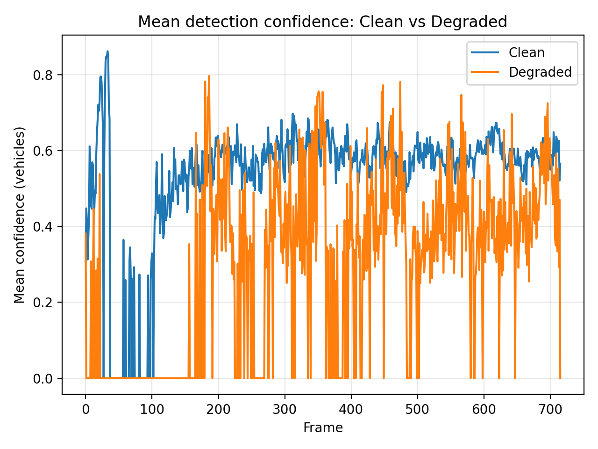
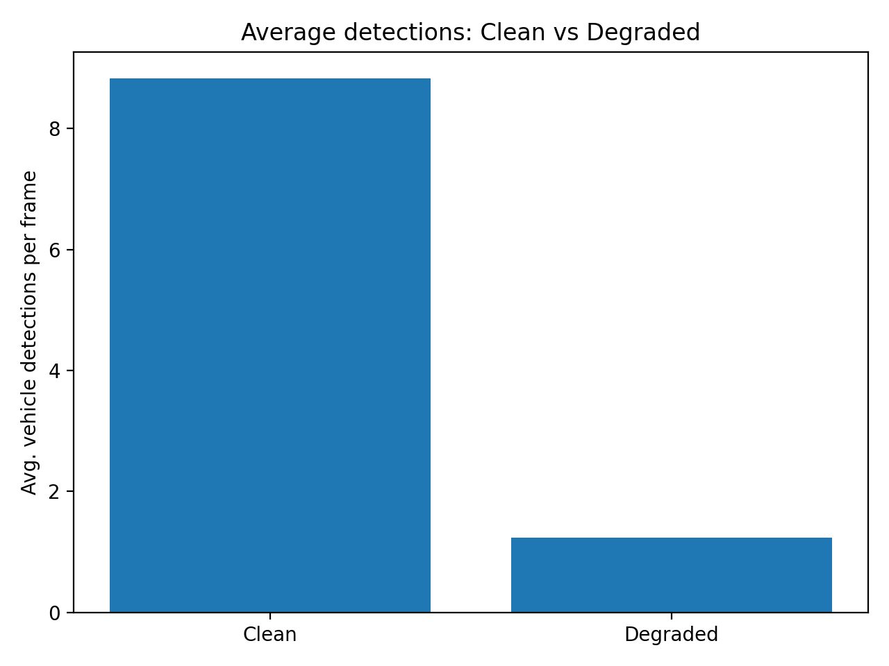
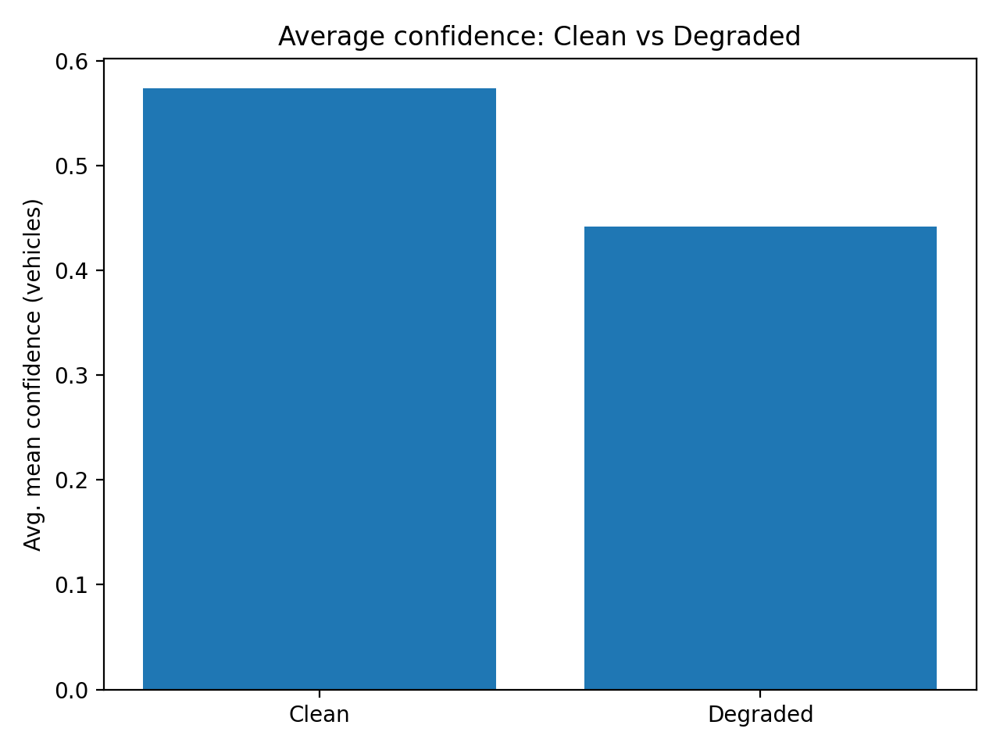

# Robust Object Detection in Harsh Real-World Environments  
### Evaluating Perception Reliability with Visual & Quantitative Evidence

Modern autonomous and vision-driven systems rarely work in perfect environments.  
They operate in dust, fog, low visibility, motion, and noisy conditions — situations where perception reliability truly matters.

This project demonstrates how object detection performance **changes between clean and harsh environments**, using:
- YOLOv8 detection  
- Realistic environmental degradation simulation  
- Quantitative analysis  
- Clear visual validation  

It presents an **engineering-focused evaluation** rather than just a demo model — making it relevant for autonomous systems, robotics, and safety-critical AI.

---

## 🎯 Objectives

This project answers a very practical question:

> **How does an object detection model behave when the real world becomes harsh and unreliable?**

Specifically, it:

✔️ Runs object detection on a clean environment  
✔️ Simulates harsh environmental conditions (fog, dust, blur, noise, low light)  
✔️ Re-runs detection under degraded conditions  
✔️ Measures detection stability and confidence  
✔️ Visualizes and analyzes performance changes  

---

# 📸 Visual Results

Below are visual demonstrations from the pipeline.

---

## 🔹 Baseline Detection (Normal Conditions)

Detection performance on the original, clean scene.

🎥 **Annotated Output Video**
results/videos/carss_yolo_baseline.mp4

---

## 🔹 Harsh Environment Simulation

The same scene was transformed to mimic real-world degradation such as:
- Fog / haze  
- Darkening  
- Dust particles  
- Motion blur  
- Sensor noise  

🎥 **Degraded Video**
data/processed/carss_degraded.mp4

---

## 🔹 Detection in Harsh Conditions

🎥 **Annotated Degraded Detection Video**
results/videos/carss_degraded_yolo.mp4

Compared to the clean version:
- Fewer detected objects  
- More unstable bounding boxes  
- Lower visual confidence  

---

# 📊 Quantitative Evaluation

Beyond visuals, the project records detection statistics and evaluates numerically.

---

## 📌 Detections Per Frame

**Insight**
- Clean video shows stable and consistent detections
- Harsh conditions significantly reduce detected objects
- Indicates missed vehicles / reduced awareness

---

## 📌 Confidence Per Frame

**Insight**
- Confidence is high in clean conditions
- Under degradation, confidence fluctuates and drops
- Model becomes uncertain → reduced reliability

---

## 📌 Summary Metrics

### Average Detections Per Frame

### Average Confidence

---

# 🧠 Key Learnings

From both visual and numerical analysis:

✔️ Detection quality **degrades significantly** in harsh environments  
✔️ Both accuracy and confidence are affected  
✔️ Perception becomes unstable and risky in safety-critical systems  

This highlights why real-world AI systems must focus on:

- Robustness
- Domain adaptation
- Multi-sensor fusion
- Real-world testing (not just benchmarks)

---

# 🛠️ Technical Pipeline

1️⃣ Baseline YOLO detection on clean video  
2️⃣ Environmental degradation simulation  
3️⃣ Re-run YOLO on degraded footage  
4️⃣ Extract per-frame statistics  
5️⃣ Generate comparison plots  
6️⃣ Interpret engineering impact  

---

## 📂 Project Structure

project/
 ├─ data/
 │   ├─ raw/
 │   └─ processed/
 ├─ results/
 │   ├─ videos/
 │   └─ plots/
 ├─ src/
 └─ README.md

---

# 🚀 Applications

This kind of robustness analysis is critical for:

- Autonomous vehicles
- Robotics perception
- Industrial automation
- Smart safety systems
- Real-world ML deployment

---

# 🏁 Conclusion

This project demonstrates:

✔️ Ability to build full AI pipelines  
✔️ Focus on real-world reliability  
✔️ Quantitative analytical thinking  
✔️ Safety and engineering awareness  
✔️ Clear communication of technical results  

It goes beyond “just running a model” and instead focuses on **how AI behaves when the real world becomes difficult**.

---

# 👤 About

This project is part of my professional AI portfolio.
I am passionate about:

- Computer Vision  
- Robotics & Autonomous Systems  
- Real-world AI deployment  
- Reliability-focused engineering  

Feel free to explore, connect, or reach out 😊
